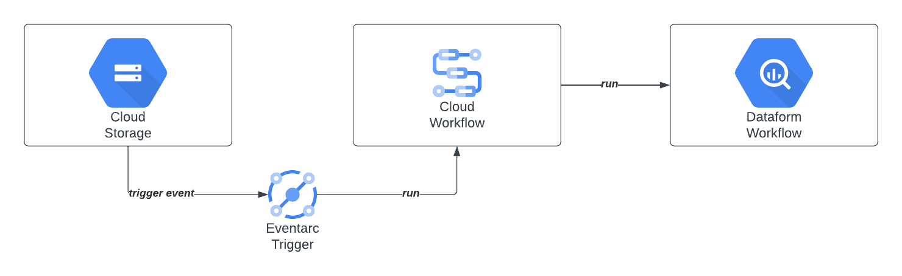

# Cloud Workflows Demo

This module is for deploying a demo [Cloud Workflow](https://cloud.google.com/workflows/docs/overview) which runs an existing Dataform workflow. Additionally, an eventarc trigger is set up to run the Cloud Workflow based on a Cloud Storage event.

## Deploy 

The [`sample-terraform-workflows-deploy.py`](../../../dags/sample-terraform-workflows-deploy.py) is script is used to automatically deploy and tear down the Terraform module for this demo via Composer DAGs.
To do so, it runs a bash script called [`sample_terraform_workflows.sh`](../../sample_terraform_workflows.sh).
Please review those files for additional details.
Run the `sample-terraform-workflows-deploy` DAG in Composer to deploy the module.

The Cloud Workflow itself is defined in the [`terraform_bigquery_dataform_execute.yaml`](../../workflows/terraform_bigquery_dataform_execute.yaml) file.

## Run the Demo

### Prerequisites

- Since the Cloud Workflow runs the [Dataform demo workflow](https://github.com/GoogleCloudPlatform/data-analytics-golden-demo/blob/main/sql-scripts/taxi_dataset/sp_create_demo_dataform.sql), the latter needs to be set up prior to running this demo. Follow the steps within the linked script to do so.
- In Dataform, synchronize the `demo_flow` environment with the main branch.

### Run

As an example, an [eventarc](https://cloud.google.com/eventarc/docs) trigger is set up to run the Cloud Workflow whenever a file is dropped into the Dataproc bucket.
You can test the eventarc trigger by adding a file to this bucket, triggering the Cloud Workflow which will in turn run the Dataform workflow.

Alternatively, you can run the Cloud Workflow manually.

After running the demo, check both the Cloud Workflow and Dataform workflow execution logs to ensure it ran successfully.

## Links

- [Link](https://github.com/GoogleCloudPlatform/data-analytics-golden-demo/blob/main/cloud-composer/data/workflows/terraform_bigquery_dataform_execute.yaml)
- Video

## Diagram

